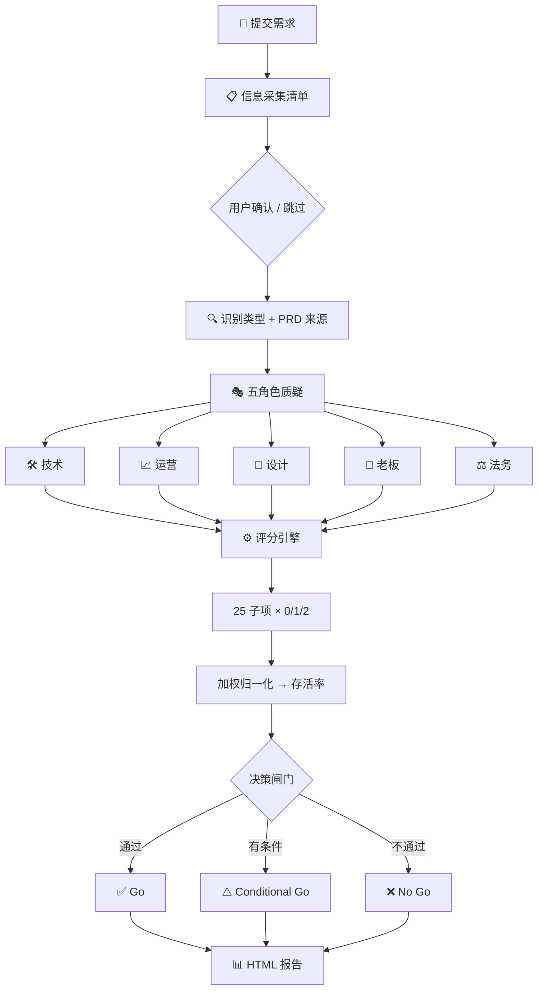

# PM 需求评审模拟器

[English](README.md)

每个人都说你的需求"挺好的"。但真到评审会，技术说做不了，运营说没人用，法务说有风险。

需求评审模拟器给你一场**五角色跨部门压测**——在真实会议之前，输出一份带存活率评分的 HTML 报告，让你带着应对方案进会议室。

## 工作流程



## 五方质疑角色

| 角色 | 他会问你什么 |
|------|-------------|
| 🛠️ 技术 | 做得出来吗？技术债怎么办？能扩展吗？ |
| 📈 运营 | 用户真会用吗？怎么推？留存靠什么？ |
| 🎨 设计 | 体验连贯吗？断裂点在哪？ |
| 👔 老板 | 和战略对齐吗？ROI 多少？ |
| ⚖️ 法务 | 合规风险？数据隐私？监管红线？ |

## 三档残酷度

| 档位 | 风格 | 适合谁 |
|------|------|--------|
| 🟢 新手村 | 温和建议，建设性语气 | 新人产品经理，第一次练习 |
| 🟡 实战 | 大厂评审会标准强度 | 评审前预演 |
| 🔴 地狱 | 全员敌对 + 行业黑话攻击 | 资深产品经理压测边界场景 |

## 你会得到什么

一份**浅蓝风格 HTML 存活率报告**（SVG 仪表盘 + 雷达图）：

- **存活率评分**——确定性评分引擎（25 子项 × 0/1/2），公式计算不靠感觉
- **五维雷达图**——可视化展示强项和致命弱点
- **决策闸门**——价值/风险/资源/战略闸门 + A/B/C 方案对比
- **杀手回复 TOP 3**——最难的 3 个问题 + "杀手回复"技巧拆解
- **RACI 矩阵**——跨团队协作方案，含冲突识别与解决
- **会议脚本**——开场 → 核心论证 → 风险应对 → 决策 → 收尾
- **行动清单**——责任人 + 截止时间 + 交付物 + 回看节点

## 适用场景

- **评审前预演**：提前暴露需求盲区，带着应对方案进会议室
- **PRD 自检**：用确定性评分引擎给需求文档做"体检"
- **新人练兵**：模拟大厂评审会压力，练习应对尖锐质疑
- **展示版 PRD 评测**：对公开发表的 PRD 文章做专业度评估

## 一句话启动

```text
帮我评审一下我们要做的拼团功能，实战模式。
```

## 安装

```bash
openclaw skills install pm-requirement-review-simulator
```

---

> 上会之前，先让五个角色帮你压测一遍。

License: MIT
