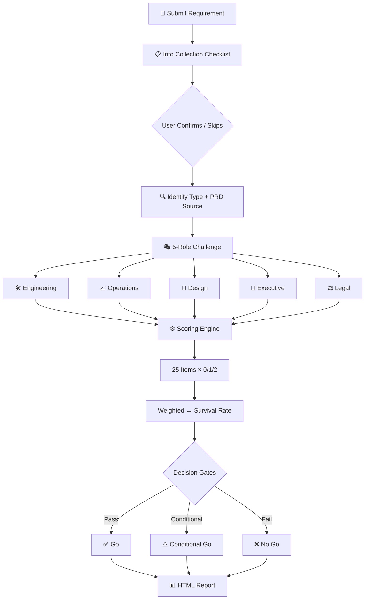

# PM Requirement Review Simulator

[中文版](README-zh.md)

Everyone says "sounds good" to your PRD. But in the real review meeting, engineering says it can't be built, operations says users won't use it, and legal says it's a liability.

The PM Requirement Review Simulator gives you a **5-role cross-functional stress test** before the real meeting — outputs a scored HTML survival report so you walk in prepared, not blindsided.

## Workflow



## 5 Challenge Roles

| Role | What They Challenge |
|------|---------------------|
| 🛠️ Engineering | Can this actually be built? What about tech debt and scaling? |
| 📈 Operations | Will users actually use this? What's the adoption path? |
| 🎨 Design | Is the UX coherent? Where's the experience gap? |
| 👔 Executive | Does this align with strategy? What's the ROI? |
| ⚖️ Legal | Any compliance risks? Data privacy? Regulatory issues? |

## Difficulty Levels

| Level | Style | Best For |
|-------|-------|----------|
| 🟢 Rookie | Gentle suggestions, constructive tone | New PMs, first-time practice |
| 🟡 Realistic | Standard big-tech review intensity | Pre-meeting dry run |
| 🔴 Hell Mode | All hostile + industry jargon attacks | Senior PMs stress-testing edge cases |

## What You Get

A **light-blue themed HTML survival report** (SVG gauge + radar chart):

- **Survival Score** — deterministic scoring engine (25 items × 0/1/2), formula-calculated
- **5-Dimension Radar Chart** — visual breakdown of strengths and fatal weaknesses
- **Decision Gates** — value / risk / resource / strategy with A/B/C option comparison
- **Counterargument Playbook** — TOP 3 hardest questions with killer reply techniques
- **RACI Matrix** — cross-team collaboration with conflict resolution
- **Meeting Script** — ready-to-use opening → core argument → risk plan → decision → close
- **Action Checklist** — owner + deadline + deliverable + review checkpoint

## Use Cases

- **Pre-review Rehearsal**: Expose blind spots before the real meeting
- **PRD Self-check**: Deterministic scoring for requirement health assessment
- **New PM Training**: Simulate big-tech review pressure in a safe environment
- **Published PRD Review**: Professional evaluation of publicly shared PRDs

## Quick Start

```text
Review my team's group-buying feature. Realistic mode.
```

## Install

```bash
openclaw skills install pm-requirement-review-simulator
```

---

> Before the real review meeting, let five roles stress-test your PRD first.

License: MIT
